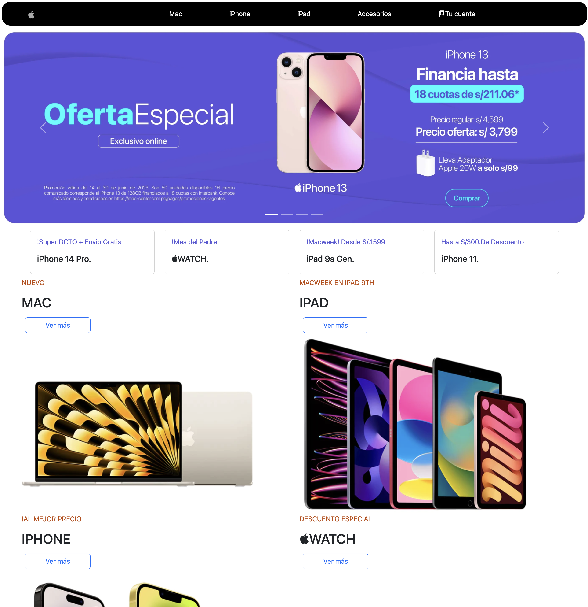

# Angular Free fake Store

A free Fake Store Template ready to use if you want to copy and pass your course, Cof😰Cof😰.. if you want to know a little bit more about Angular. Just fetch data from your favorite API or server and thats it!

# Backend server

Originally, this project was implemented with Java Spring Framework. If you want to change this,
only remove services and re-adjust the project.

# CSS Frameworks

This project only use Bootstrap. No Taiwild. No others!.

